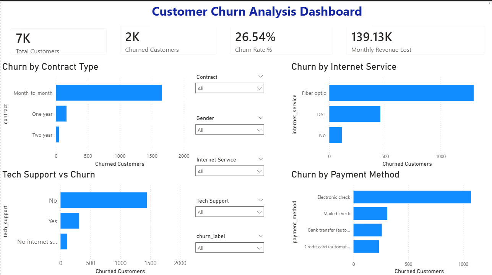
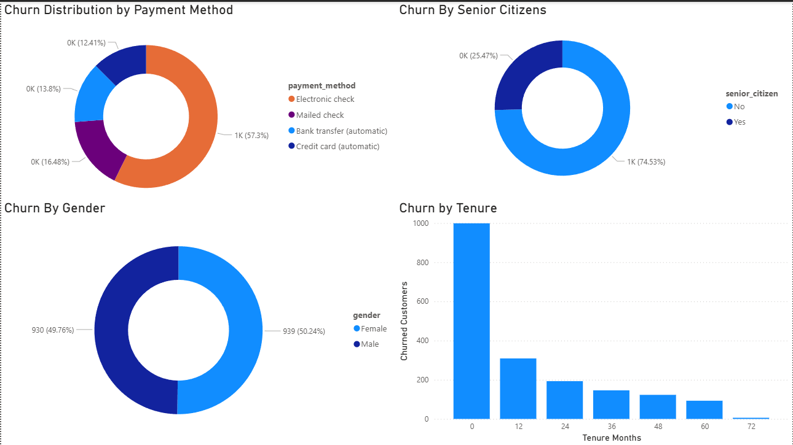
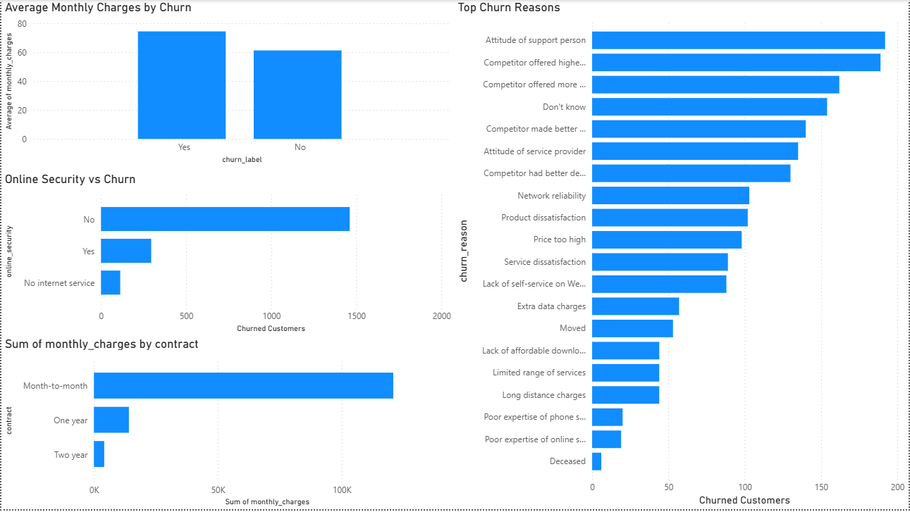
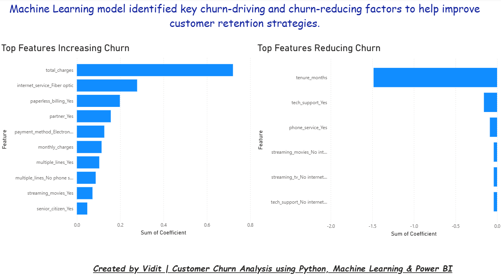
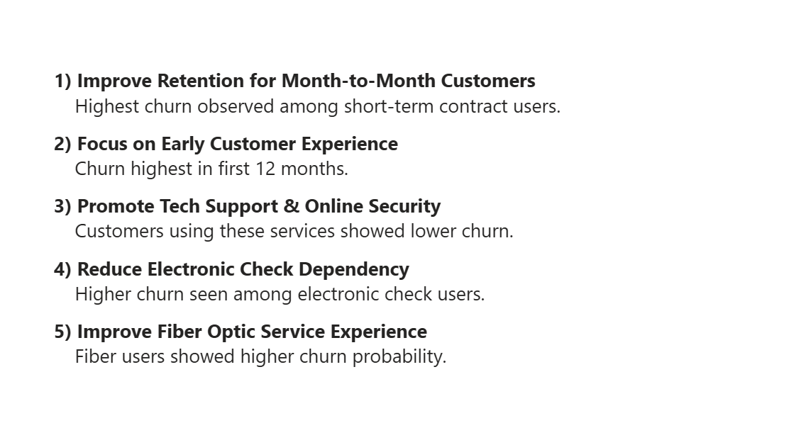

# Customer Churn Analysis & Prediction




## Project Overview
This project analyzes customer churn behavior using SQL, Python, Machine Learning, and Power BI.

The objective of this project is to:
- Identify major factors responsible for customer churn
- Predict customer churn using Machine Learning
- Generate actionable business insights
- Build an interactive dashboard for decision-making

This is an end-to-end analytics project covering:
- Data Cleaning
- Exploratory Data Analysis (EDA)
- SQL Analysis
- Machine Learning
- Feature Importance Analysis
- Business Recommendations
- Interactive Power BI Dashboard

---

## Tech Stack
- Python
- Pandas
- NumPy
- Matplotlib
- Seaborn
- Scikit-learn
- SQL
- Power BI
- Jupyter Notebook

---

## Machine Learning Model
### Logistic Regression
Model was trained using:
- Train-Test Split
- StandardScaler
- Logistic Regression
- Feature Importance Analysis

### Model Performance
- Accuracy: **81.37%**
- Precision (Churn Class): **0.70**
- Recall (Churn Class): **0.58**
- F1-Score (Churn Class): **0.64**

---

# Executive Overview Dashboard


---

# Customer Demographics Dashboard



---

# Churn Drivers & Revenue Dashboard



---

# ML Insights & Retention Factors Dashboard



---

# Business Recommendations



---

## Key Business Insights
- Month-to-month contract customers showed the highest churn.
- Fiber optic internet users had higher churn probability.
- Customers without tech support and online security were more likely to churn.
- Long tenure customers were less likely to churn.
- Electronic check payment users showed higher churn rates.
- Senior citizens showed relatively higher churn behavior.

---

## Project Structure

```bash
customer-churn-analysis/
│
├── data/
├── images/
├── notebooks/
├── outputs/
├── powerbi/
├── sql/
└── README.md
```

---

## Project Files
- Power BI Dashboard (.pbix)
- Jupyter Notebook (.ipynb)
- SQL Query File
- Cleaned Dataset
- Machine Learning Outputs
- Dashboard Screenshots

---

## Author
Vidit Bhatnagar
